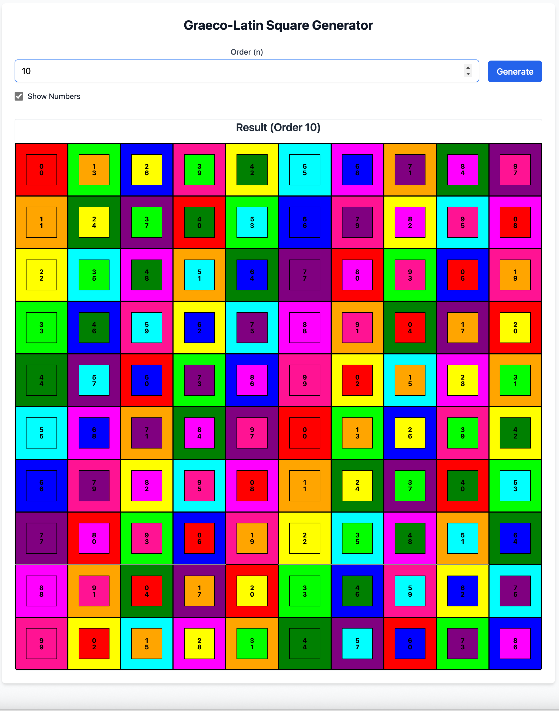
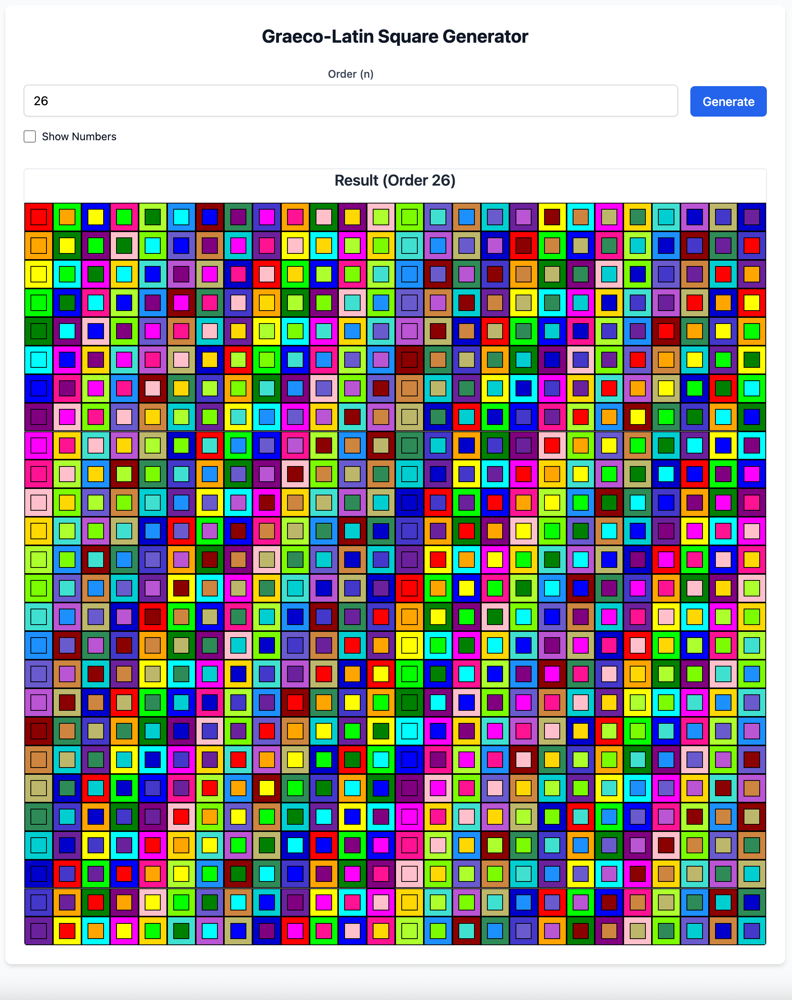

# Graeco-Latin Square Generator

[](https://vercel.com/saas-erp-hub/graeco-latin-square-generator)
[](https://opensource.org/licenses/MIT)
[](https://github.com/saas-erp-hub/graeco-latin-square-generator/actions/workflows/ci.yml)


## About This Project

This generator creates Graeco-Latin Squares and visualizes them in a particularly clear and intuitive way. Unlike traditional representations that often rely on the Greek and Latin alphabets, this tool focuses on a clear and understandable visualization of the underlying mathematical structure. It is a useful tool for anyone interested in combinatorial design, experimental planning, or simply the beauty of mathematical patterns.

## Features

*   **Graeco-Latin Square Generation:** Generates Graeco-Latin Squares for various orders.
*   **Intuitive Visualization:** Displays the generated squares in an easy-to-understand format.
*   **Interactive User Interface:** Allows for easy input of the desired order and display of results.
*   **Web-based:** Runs directly in the browser, no installation required.

### Color Visualization

The visualization uses a carefully curated color palette to represent the numerical values within the Graeco-Latin Squares. While the palette is designed for good general distinguishability, it's important to note the inherent limitations:

*   **Perceptual Limits:** The human eye can only reliably distinguish a limited number of distinct colors, especially when displayed in small areas or in close proximity. Our palette aims for a good compromise, but for very high orders (e.g., above 40), some colors may appear similar, even if their underlying numerical values are unique.
*   **Color Repetition:** If the order of the square (`n`) exceeds the number of unique colors in the palette, colors will necessarily repeat. While the underlying numerical pairs remain unique (a core property of Graeco-Latin Squares), the individual colors will not be unique per row or column in such cases.
*   **Accessibility:** This palette has not been optimized for color blindness. Future improvements may address this.

## How It Works

The project generates Graeco-Latin Squares in the background using algorithms based on established mathematical theories for constructing orthogonal Latin Squares. The resulting squares are then visualized in a user-friendly interface that highlights the unique properties of these mathematical structures.

The core generation logic distinguishes between prime and composite orders:

*   **For Prime Orders (n):** The algorithm constructs two orthogonal Latin Squares. The first square (A) is generated using the standard `(i + j) % n` method. The second square (B) is constructed using `(i + k * j) % n`, where `k` is a primitive root modulo `n`. This is a mathematically recognized and correct method for prime orders.
*   **For Composite Orders (n, excluding 2 and 6):** The algorithm also constructs two orthogonal Latin Squares. The first square (A) uses `(i + j) % n`. The second square (B) uses `(i + k * j) % n`, where `k` is the smallest integer coprime to `n`. This is also a known method for constructing orthogonal Latin Squares for composite orders.

The implementation correctly handles the non-existence of Graeco-Latin Squares for orders 2 and 6.

## Screenshots






## Setup and Usage

To run the project locally, follow these steps:

1.  **Clone the repository:**
    ```bash
    git clone https://github.com/saas-erp-hub/graeco-latin-square-generator.git
    cd graeco-latin-square-generator
    ```

2.  **Install dependencies:**
    ```bash
    npm install
    ```

3.  **Start the project:**
    ```bash
    npm start
    ```
    The project will open in your browser at `http://localhost:3000` (or a similar port).

## Project Structure

*   `src/GraecoLatinSquareGenerator.tsx`: Contains the core logic for generating and visualizing Graeco-Latin Squares.
*   `public/index.html`: The main HTML file for the application.
*   `public/images/`: Folder for screenshots and other images.
*   `package.json`: Defines project metadata and dependencies.

## Future Improvements

*   Option to display with Greek and Latin symbols.
*   Support for generating and visualizing Graeco-Latin Squares of higher orders (current research indicates that online tools for orders above 10 are rare, and for very large orders like n=50, programmatic approaches are required).
*   Export options for generated squares (e.g., as image, CSV).
*   Enhanced input validation.
*   **Consider a Development CLI:** Explore the possibility of adding a command-line interface for development tasks such as generating square data for testing, running specific test suites, or performing performance tests.
*   **Enhance User Feedback and Examples:** Improve user feedback mechanisms within the UI and provide more detailed examples in the documentation.

## License

This project is licensed under the MIT License. See the `LICENSE` file for more details.


## Contact

For questions, feedback, or suggestions, please open an issue on the [GitHub Issues page](https://github.com/saas-erp-hub/graeco-latin-square-generator/issues). This is the preferred method of communication as it helps keep all project-related discussions in one place.

## Acknowledgements

*   [Contributor Covenant](https://www.contributor-covenant.org/) for the Code of Conduct.
*   [Georges Perec](https://en.wikipedia.org/wiki/Georges_Perec) for inspiring the "thirty-six officers problem" reference.
*   The mathematical community for their extensive research on Graeco-Latin Squares.
*   All contributors to this project.